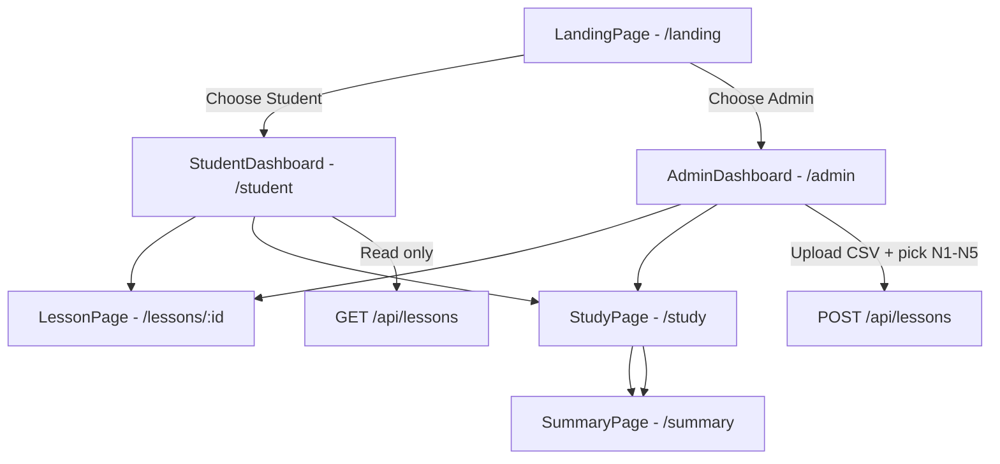

# Jappy — Admin / Student Role Split & JLPT N1–N5 Reorganisation

## Overview

Transform Jappy from a single-user flashcard importer into a **two-role app** with no authentication — just a simple role selector on the landing page.

| Role | Capabilities |
|------|-------------|
| **Admin** | Upload CSV lessons for any JLPT level (N1–N5), view/manage/delete all lessons, study cards |
| **Student** | Browse beautifully organised N5→N1 lesson cards, study any lesson — **no import/delete** |

---

## Architecture Diagram



---

## Step-by-step Implementation Plan

### 1. Database — Add `level` column

**Files:** [`src/db/neon.ts`](src/db/neon.ts:line), [`src/db/index.ts`](src/db/index.ts:line)

- Neon (PostgreSQL): Add `level TEXT NOT NULL DEFAULT 'N5'` column to `lessons` table via migration
- Dexie (local fallback): Bump to v3, add `level` index to `lessons` store
- Also ensure existing rows without `level` get a backfill/alter

```sql
ALTER TABLE lessons ADD COLUMN IF NOT EXISTS level TEXT NOT NULL DEFAULT 'N5';
```

---

### 2. Types — Add `JLPTLevel` and update `Lesson`

**File:** [`src/types/index.ts`](src/types/index.ts:line)

```ts
export type JLPTLevel = 'N1' | 'N2' | 'N3' | 'N4' | 'N5';

export interface Lesson {
  id?: number;
  name: string;
  level: JLPTLevel;        // NEW
  importedAt: number;
}
```

Also add a `level` field to `LessonStats` if needed for the admin view.

---

### 3. Landing Page — Role selector

**New file:** `src/pages/LandingPage.tsx`

- Full-screen centered splash with Jappy logo/branding
- Two large, visually distinct buttons:
  - **"I'm a Student"** → navigates to `/student`
  - **"I'm an Admin"** → navigates to `/admin`
- Subtle tagline under each explaining the role
- Add a small "switch role" link in both dashboards to return to landing

**New CSS needed:**
- `.landing-page` — full viewport centering
- `.role-card` — large tappable cards with icons, hover/active states
- Responsive for mobile (cards stack vertically)

---

### 4. Student Dashboard — N5→N1 organised, read-only

**New file:** `src/pages/StudentDashboard.tsx`

- Top bar with logo, "Switch to Admin" ghost link, and total due count
- Lessons grouped into **5 category cards** — one per JLPT level:
  - Each card has a distinct accent colour (N5=green, N4=blue, N3=orange, N2=purple, N1=red)
  - Shows: level badge, count of lessons, total due cards
  - Expandable/collapsible or always-open list of lessons within each level
- Each lesson inside a category uses the existing `LessonCard` component (click → `/lessons/:id`)
- **No import CSV button, no delete button** — purely read-only
- If no lessons exist for a level, show an empty state ("No N3 lessons yet — check back later")

**Key constraint:** Use the existing [`useLessons`](src/hooks/useLessons.ts:line) hook, which already fetches all lessons. Group them client-side by `level`.

---

### 5. Admin Dashboard — Upload + Manage

**New file:** `src/pages/AdminDashboard.tsx`

- Top bar: logo, "Switch to Student" link, "Study All" button
- **Upload section** (prominent card at top):
  - Drag-and-drop or click-to-upload CSV area
  - **JLPT Level dropdown** (N1–N5) — required before upload
  - File input for CSV (uses existing [`parseCSV`](src/utils/csvParser.ts:line))
  - "Import" button with loading state
  - Success/error alerts (reuse existing alert styles)
- **Lesson list** below, also grouped by JLPT level (like student view but editable):
  - Each lesson shows: name, card count, due count, level badge, progress bar
  - Delete button (trash icon) on each lesson card (reuses `removeLesson`)
- Clicking a lesson navigates to `/lessons/:id` (same as student)

---

### 6. API Updates — `level` field throughout

**File:** [`api/lessons.ts`](api/lessons.ts:line)

- **POST `/api/lessons`**: Accept `level` from request body
  ```json
  { "name": "N3 Verbs", "level": "N3", "cards": [...] }
  ```
- **GET `/api/lessons`**: Return `level` in each lesson object; optionally accept `?level=N3` query param to filter
- **GET `/api/lessons?id=X`**: Return `level` in single lesson response
- **DELETE `/api/lessons?id=X`**: No change needed

**File:** [`api/cards.ts`](api/cards.ts:line) — no changes needed (cards don't carry level directly)

**File:** [`src/db/neon.ts`](src/db/neon.ts:line) — update the `CREATE TABLE IF NOT EXISTS lessons` migration to include `level` column

---

### 7. Client API Layer

**File:** [`src/api/client.ts`](src/api/client.ts:line)

- Update `LessonWithStats` to include `level: JLPTLevel`
- Update `importLesson` signature to accept `level`:
  ```ts
  export async function importLesson(name: string, level: JLPTLevel, cards: ...): Promise<LessonWithStats>
  ```
- Update POST body to include `level`

---

### 8. Routing — App.tsx restructure

**File:** [`src/App.tsx`](src/App.tsx:line)

```tsx
<Routes>
  <Route path="/" element={<LandingPage />} />
  <Route path="/student" element={<StudentDashboard />} />
  <Route path="/admin" element={<AdminDashboard />} />
  <Route path="/lessons/:id" element={<LessonPage />} />
  <Route path="/study" element={<StudyPage />} />
  <Route path="/summary" element={<SummaryPage />} />
</Routes>
```

The `/` route is now the landing page. Shared routes (`/lessons/:id`, `/study`, `/summary`) are used by both roles.

---

### 9. Adapt Existing Pages

**File:** [`src/pages/LessonPage.tsx`](src/pages/LessonPage.tsx:line)

- Show the JLPT level badge next to the lesson name
- Remove or keep the delete button (show only in admin context — could pass a prop or use a simple URL-based check)
- Back button goes to the appropriate dashboard (not always `/`)

**File:** [`src/pages/HomePage.tsx`](src/pages/HomePage.tsx:line)

- This becomes redundant — its logic is absorbed into `AdminDashboard` and `StudentDashboard`
- Either repurpose it or remove it from routing

**File:** [`src/pages/StudyPage.tsx`](src/pages/StudyPage.tsx:line) — minimal changes; close button navigates appropriately

**File:** [`src/pages/SummaryPage.tsx`](src/pages/SummaryPage.tsx:line) — minimal changes; home button navigates appropriately

---

### 10. CSS Additions

**File:** [`src/index.css`](src/index.css:line)

New classes needed:

| Class | Purpose |
|-------|---------|
| `.landing-page` / `.landing-card` | Splash screen with role selection |
| `.level-grid` | Grid layout for N1–N5 category cards |
| `.level-card` | Individual JLPT level card with accent colour |
| `.level-badge` | Small pill showing N1–N5 label |
| `.upload-zone` | Drag-and-drop CSV upload area |
| `.level-select` | Styled dropdown for JLPT level picker |
| `.dashboard-header` | Shared header for both dashboards |

Level accent colours (CSS custom properties):
```css
:root {
  --n5-color: #58CC02;  /* green */
  --n4-color: #1CB0F6;  /* blue */
  --n3-color: #FF9600;  /* orange */
  --n2-color: #CE82FF;  /* purple */
  --n1-color: #FF4B4B;  /* red */
}
```

---

### 11. Vite Dev Plugin

**File:** [`vite.config.ts`](vite.config.ts:line) — No changes needed; the existing `apiDevPlugin` already routes all `/api/*` requests.

---

## File Change Summary

| File | Action |
|------|--------|
| `src/types/index.ts` | **Modify** — add `JLPTLevel` type, add `level` to `Lesson` |
| `src/db/neon.ts` | **Modify** — add `level` column to migration SQL |
| `src/db/index.ts` | **Modify** — bump Dexie version, add `level` index |
| `api/lessons.ts` | **Modify** — accept/return `level` in POST/GET |
| `src/api/client.ts` | **Modify** — update types and `importLesson` signature |
| `src/hooks/useLessons.ts` | **Modify** — update `importCSV` to pass `level` |
| `src/App.tsx` | **Modify** — new routes |
| `src/pages/LandingPage.tsx` | **New** — role selector |
| `src/pages/StudentDashboard.tsx` | **New** — read-only N5→N1 view |
| `src/pages/AdminDashboard.tsx` | **New** — upload + manage |
| `src/pages/HomePage.tsx` | **Modify/Remove** — absorbed into new dashboards |
| `src/pages/LessonPage.tsx` | **Modify** — show level badge, adjust navigation |
| `src/pages/StudyPage.tsx` | **Minor modify** — adjust back/close navigation |
| `src/pages/SummaryPage.tsx` | **Minor modify** — adjust home navigation |
| `src/index.css` | **Modify** — add new component styles |