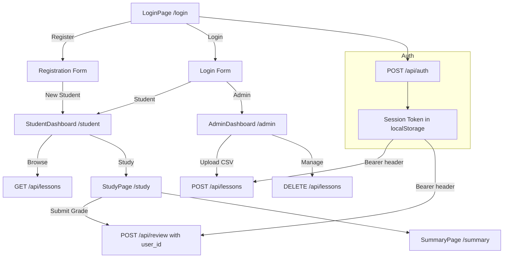

# Jappy — Multi-User Authentication System (Simplified)

## Architecture Overview

**Current State:** Single-user app with role selector (student/admin) stored in `localStorage`. No real authentication. All users share the same `review_records` and `session_logs` tables.

**Target State:** Multi-user app with bcrypt-based password authentication. Admin uploads shared lessons once; each student has their own personal spaced-repetition progress. Users log in with credentials, receive a session token.



---

## Database Schema Changes

### New `users` Table

```sql
CREATE TABLE IF NOT EXISTS users (
  id            SERIAL PRIMARY KEY,
  username      TEXT NOT NULL UNIQUE,
  email         TEXT NOT NULL UNIQUE,
  password_hash TEXT NOT NULL,
  role          TEXT NOT NULL CHECK (role IN ('student', 'admin')),
  created_at    BIGINT NOT NULL DEFAULT (EXTRACT(EPOCH FROM NOW()) * 1000)::BIGINT
);
```

### New `sessions` Table

```sql
CREATE TABLE IF NOT EXISTS sessions (
  id            SERIAL PRIMARY KEY,
  user_id       INTEGER NOT NULL REFERENCES users(id) ON DELETE CASCADE,
  token         TEXT NOT NULL UNIQUE,
  created_at    BIGINT NOT NULL DEFAULT (EXTRACT(EPOCH FROM NOW()) * 1000)::BIGINT,
  expires_at    BIGINT NOT NULL
);
CREATE INDEX IF NOT EXISTS idx_sessions_token ON sessions(token);
```

### Alter `review_records` — Add `user_id`

```sql
ALTER TABLE review_records ADD COLUMN IF NOT EXISTS user_id INTEGER REFERENCES users(id) ON DELETE CASCADE;
-- Drop old UNIQUE constraint on card_id, add new composite UNIQUE
-- New: UNIQUE(card_id, user_id) — so each user has their own review record per card
```

### Alter `session_logs` — Add `user_id`

```sql
ALTER TABLE session_logs ADD COLUMN IF NOT EXISTS user_id INTEGER REFERENCES users(id) ON DELETE CASCADE;
```

### Dexie (local IndexedDB fallback) — Schema v4

```
lessons:        '++id, name, level, importedAt'
cards:          '++id, lessonId, japanese'
review_records: '++id, [cardId+userId], dueDate'
session_logs:   '++id, cardId, reviewedAt, userId'
users:          '++id, username, email, role'
sessions:       '++id, userId, token'
```

---

## API Design

### New: `api/auth.ts` — Authentication Endpoints

| Method | Path | Body | Response | Description |
|--------|------|------|----------|-------------|
| `POST` | `/api/auth/register` | `{ username, email, password, role }` | `{ user, token }` | Register new user. Admin registration requires `ADMIN_SECRET` env var. |
| `POST` | `/api/auth/login` | `{ email, password }` | `{ user, token }` | Login, returns session token. |
| `POST` | `/api/auth/logout` | `{ token }` | `{ success }` | Delete session. |
| `GET` | `/api/auth/me` | — (token in header) | `{ user }` | Get current user from token. |

**Token format:** `crypto.randomUUID()` — 36-char UUID stored in `sessions` table. Sent as `Authorization: Bearer <token>` header.

**Password hashing:** `bcryptjs` (pure JS, Edge-compatible). 10 salt rounds.

**Admin seed:** Environment variable `ADMIN_SECRET`. When registering with `role: 'admin'`, the request body must include `adminSecret` matching the env var.

### Auth Middleware Helper

```ts
// src/api/auth.ts (shared helper)
export async function verifyToken(req: Request): Promise<{ userId: number; role: string } | null> {
  const header = req.headers.get('Authorization');
  if (!header?.startsWith('Bearer ')) return null;
  const token = header.slice(7);
  const rows = await sql`SELECT user_id, expires_at FROM sessions WHERE token = ${token}`;
  if (rows.length === 0) return null;
  const session = rows[0] as { user_id: number; expires_at: number };
  if (session.expires_at < Date.now()) return null;
  const userRows = await sql`SELECT role FROM users WHERE id = ${session.user_id}`;
  if (userRows.length === 0) return null;
  return { userId: session.user_id, role: (userRows[0] as any).role };
}
```

### Updated: `api/lessons.ts` — Auth-protected

- `GET` — No auth required (students browse lessons).
- `POST` — **Admin only.** Verify token → check `users.role = 'admin'`.
- `DELETE` — **Admin only.** Same check.

### Updated: `api/review.ts` — User-scoped

- `GET /api/review?lessonId=X` — Requires auth. Query `review_records` filtered by `user_id`.
- `POST /api/review` — Requires auth. Insert/update `review_records` with `user_id` and `session_logs` with `user_id`.

### Updated: `api/cards.ts` — No user-scoping needed

- Cards are lesson content (shared). No user_id needed.
- `GET /api/cards?lessonId=X` — No auth required.

---

## Frontend Architecture

### New Component Tree

```
App.tsx
├── AuthProvider (React Context)
│   ├── LoginPage (/login)
│   │   ├── LoginForm (email + password)
│   │   └── RegisterForm (username + email + password + role)
│   ├── ProtectedRoute (wrapper)
│   │   ├── StudentDashboard (/student)
│   │   │   ├── NavBar (logo + logout button)
│   │   │   ├── LevelFilterPills (N5–N1)
│   │   │   └── LessonCard[] (grouped by level)
│   │   ├── AdminDashboard (/admin)
│   │   │   ├── NavBar (logo + logout button)
│   │   │   ├── CSVUploadSection (drag-drop + level selector)
│   │   │   └── LessonCard[] (with delete buttons)
│   │   ├── LessonPage (/lessons/:id)
│   │   ├── StudyPage (/study)
│   │   └── SummaryPage (/summary)
│   └── LandingPage (/) → Redirect based on auth state
```

### AuthContext (`src/contexts/AuthContext.tsx`)

```ts
interface AuthState {
  user: User | null;
  token: string | null;
  loading: boolean;
  login: (email: string, password: string) => Promise<void>;
  register: (data: RegisterData) => Promise<void>;
  logout: () => Promise<void>;
}

interface User {
  id: number;
  username: string;
  email: string;
  role: 'student' | 'admin';
}
```

- On mount, reads `token` from `localStorage`, calls `GET /api/auth/me` to validate.
- On login/register, stores `token` in `localStorage`.
- On logout, clears `localStorage` and calls `POST /api/auth/logout`.

### Updated: `src/api/client.ts`

Add `Authorization` header to all requests:

```ts
function getAuthHeaders(): Record<string, string> {
  const token = localStorage.getItem('jappy_token');
  return token ? { Authorization: `Bearer ${token}` } : {};
}
```

### Updated: `src/App.tsx`

```tsx
<AuthProvider>
  <BrowserRouter>
    <Routes>
      <Route path="/login" element={<LoginPage />} />
      <Route path="/" element={<LandingPage />} />
      <Route path="/student" element={<ProtectedRoute role="student"><StudentDashboard /></ProtectedRoute>} />
      <Route path="/admin" element={<ProtectedRoute role="admin"><AdminDashboard /></ProtectedRoute>} />
      <Route path="/lessons/:id" element={<ProtectedRoute><LessonPage /></ProtectedRoute>} />
      <Route path="/study" element={<ProtectedRoute><StudyPage /></ProtectedRoute>} />
      <Route path="/summary" element={<ProtectedRoute><SummaryPage /></ProtectedRoute>} />
    </Routes>
  </BrowserRouter>
</AuthProvider>
```

### `ProtectedRoute` Component

- If `loading` → show spinner.
- If `!user` → redirect to `/login`.
- If `role` prop and `user.role !== role` → redirect to correct dashboard.
- Otherwise → render children.

### LoginPage Design

- Clean centered card with Jappy logo at top.
- Two tabs: "Login" / "Register".
- Login form: email + password + submit button.
- Register form: username + email + password + role selector (student/admin).
- If admin is selected during registration, show an `adminSecret` field.
- Form validation with inline error messages.

---

## Files to Create / Modify

### New Files

| File | Purpose |
|------|---------|
| `src/contexts/AuthContext.tsx` | Auth state management, login/register/logout |
| `src/components/ProtectedRoute.tsx` | Route guard wrapper |
| `src/pages/LoginPage.tsx` | Login/Register page |
| `api/auth.ts` | Auth API endpoints (register, login, logout, me) |

### Modified Files

| File | Changes |
|------|---------|
| `src/db/neon.ts` | Add `users` and `sessions` table migrations; alter `review_records` and `session_logs` |
| `src/db/index.ts` | Dexie v4 schema with `users`, `sessions`, `userId` indexes |
| `src/types/index.ts` | Add `User`, `Session`, `AuthResponse` types |
| `src/api/client.ts` | Add auth headers; add `login`, `register`, `logout`, `getMe` functions |
| `src/App.tsx` | Wrap with `AuthProvider`; add `/login` route; protect all routes |
| `src/pages/LandingPage.tsx` | Simplify to redirect based on auth state |
| `src/pages/AdminDashboard.tsx` | Add logout button; remove role selector |
| `src/pages/StudentDashboard.tsx` | Add logout button; remove role selector |
| `src/pages/StudyPage.tsx` | Pass `userId` to review submissions |
| `api/lessons.ts` | Add admin-only auth check for POST/DELETE |
| `api/review.ts` | Add auth check; filter by `user_id`; include `user_id` in inserts |
| `src/hooks/useSession.ts` | Pass `userId` when submitting grades |
| `src/index.css` | Add login page styles |

### Files to Remove

| File | Reason |
|------|--------|
| `src/utils/role.ts` | Replaced by real auth system |

---

## Implementation Order

1. Database migration — Add users/sessions tables, alter review_records/session_logs.
2. Install `bcryptjs` — `npm install bcryptjs && npm install -D @types/bcryptjs`.
3. Update `src/types/index.ts` — Add User, Session, AuthResponse types.
4. Create `api/auth.ts` — Register, login, logout, me endpoints with verifyToken helper.
5. Update `api/review.ts` — Add `user_id` to queries and inserts.
6. Update `api/lessons.ts` — Admin-only check for POST/DELETE.
7. Create `src/contexts/AuthContext.tsx` — Frontend auth state management.
8. Create `src/components/ProtectedRoute.tsx` — Route guard.
9. Create `src/pages/LoginPage.tsx` — Login/register UI.
10. Update `src/App.tsx` — Wire up auth and protected routes.
11. Update `src/pages/LandingPage.tsx` — Redirect logic.
12. Update `src/api/client.ts` — Auth headers + auth API functions.
13. Update `src/hooks/useSession.ts` — Pass user_id.
14. Update `src/pages/AdminDashboard.tsx` — Logout button, remove role selector.
15. Update `src/pages/StudentDashboard.tsx` — Logout button, remove role selector.
16. Update `src/db/neon.ts` — Add migrations.
17. Update `src/db/index.ts` — Dexie v4 schema.
18. Remove `src/utils/role.ts`.
19. Add login page CSS to `src/index.css`.
20. Test full flow end-to-end.